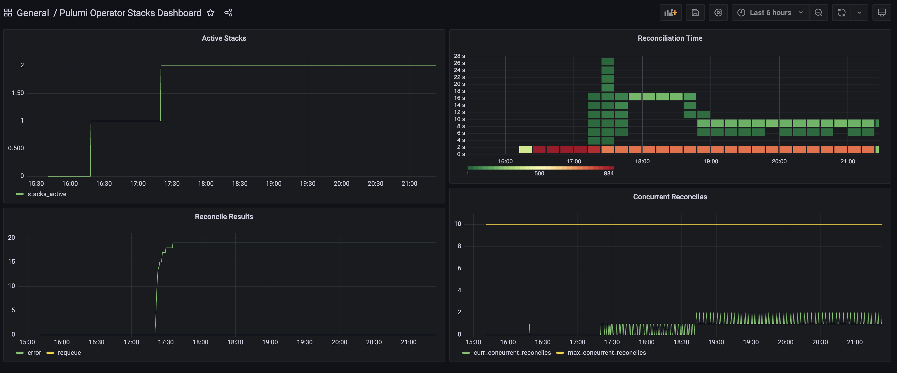

# Prometheus Metrics Integration Guide

## Introduction

The Pulumi Kubernetes Operator emits Prometheus compatible metrics.
This can be great for users to get operational insights into stacks
managed by the operator.

We provide an overview of the metrics emitted by the operator and the simplest steps necessary to emit metrics to Prometheus from the Operator.

## Prometheus Integration
If key parts of the Prometheus metrics stack are installed on the Kubernetes cluster, then as part of the initial launch
Pulumi Kubernetes Operator will automatically:
1. Create a service `pulumi-kubernetes-operator-metrics` which provides detailed operator metrics through port `8383`
2. Install a `ServiceMonitor` resource named `pulumi-kubernetes-operator-metrics` resource which is used to discover the endpoints for metric collection

Once the above are created, Prometheus will update its target scraping rules to include the Operator pod.

## Metrics Overview

The current implementation explicitly emits the following metrics:

1. `stacks_active` - a `gauge` time series that reports the number of currently registered stacks managed by the system
2. `stacks_failing` - a set of `gauge` time series, labelled by namespace, that gives the number of stacks currently failing (`stack.status.lastUpdate.state` is `failed`)
3. `stacks_reconciling` - a set of `gauge` time series, labelled by namespace, that gives the number of stacks currently reconciling (`stack.status.conditions` contains a Condition of type `Reconciling` that is `True`)
4. `programs_active` - a `gauge` time series that reports the number of currently registered programs managed by the system

In addition, we find tracking the following metrics emitted by the controller-runtime would be useful to track:

1. `controller_runtime_active_workers{controller="stack-controller"}` - `gauge` that tracks the number of concurrent stacks being processed
2. `controller_runtime_max_concurrent_reconciles{controller="stack-controller"}` - `gauge` that tracks the max concurrent stack reconciles configured. This defaults to 10 but can be controlled through `MAX_CONCURRENT_RECONCILES` environment variable passed to the Operator container.
3. `controller_runtime_reconcile_total{controller="stack-controller",result="error"}` - `counter` for errored reconciles
4. `controller_runtime_reconcile_total{controller="stack-controller",result="requeue"}` - `counter` for requeued reconciles

The next section walks through setting up `Kube-Prometheus-Stack` on an existing Kubernetes cluster and configuring metrics for the operator.

## Integration with Kube-Prometheus-Stack Installed Using Helm

We assume at this point you already have a Kubernetes cluster launched and have set up `kubeconfig` to point to this cluster.
If this is not true, please [follow the steps here](https://www.pulumi.com/docs/tutorials/kubernetes/#clusters) to launch a Kubernetes cluster of your liking.

### Setup `Kube-Prometheus-Stack` metrics stack

[Kube-Prometheus-Stack](https://github.com/prometheus-community/helm-charts/tree/main/charts/kube-prometheus-stack) is an all-in-one Prometheus-based metric solution in a Helm Chart.
It packages [Kube-Prometheus](https://github.com/prometheus-operator/kube-prometheus) which consists of Prometheus Operator, Prometheus, Grafana, Alert Manager, node-exporters, etc.
Installing the `kube-prometheus-stack` Helm Chart is the simplest means to have all the components of the metrics stack installed on your cluster.

Use the following Pulumi Program to install a `Kube-Prometheus-Stack` Helm Release on your cluster

**Important** - please note the override of the `serviceMonitorSelectorNilUsesHelmValues` value. Not setting this will potentially prevent the Operator metrics services from being scraped.
```typescript
import * as pulumi from "@pulumi/pulumi";
import * as kubernetes from "@pulumi/kubernetes";

const promOperator = new kubernetes.helm.v3.Release("prom-operator", {
    name: "kube-prometheus-stack",
    chart: "kube-prometheus-stack",
    repositoryOpts: {
        repo: "https://prometheus-community.github.io/helm-charts",
    },
    values: {
        prometheus: {
            prometheusSpec: {
                serviceMonitorSelectorNilUsesHelmValues: false,
            },
        },
    },
});
```

Next install the Pulumi Kubernetes Operator. See the detailed installation instructions [here](../README.md#deploy-the-operator) for details.

Once installed, you can perform the following steps to determine if Prometheus is scraping the metrics endpoint on port `8383`:

1. Setup a port-forward against the Prometheus service: 

    `kubectl port-forward service/kube-prometheus-stack-prometheus 9090:9090`

2. Visit `http://localhost:9090/targets` and validate that `pulumi-kubernetes-operator-metrics` is known and being scraped.


### Sample Grafana Dashboard



`kube-prometheus-stack` also installs Grafana which can be used to visualize the metrics collected.
This section walks through setting up a simple dashboard to track some key Operator metrics.

1. Port forward the Grafana service for local access:

    `kubectl port-forward service/kube-prometheus-stack-grafana 9000:80`

2. Extract the default admin username and password from the secret created by the Helm chart. Note the secret values will be base64 encoded:

    `kubectl get secret kube-prometheus-stack-grafana -o yaml | grep admin`

3. Copy the sample dashboard JSON specification below

<details>
<summary>Click to expand sample dashboard </summary>

```json
{
  "annotations": {
    "list": [
      {
        "builtIn": 1,
        "datasource": "-- Grafana --",
        "enable": true,
        "hide": true,
        "iconColor": "rgba(0, 211, 255, 1)",
        "name": "Annotations & Alerts",
        "target": {
          "limit": 100,
          "matchAny": false,
          "tags": [],
          "type": "dashboard"
        },
        "type": "dashboard"
      }
    ]
  },
  "editable": true,
  "gnetId": null,
  "graphTooltip": 0,
  "id": 26,
  "links": [],
  "panels": [
    {
      "datasource": null,
      "description": "",
      "fieldConfig": {
        "defaults": {
          "color": {
            "mode": "palette-classic"
          },
          "custom": {
            "axisLabel": "",
            "axisPlacement": "auto",
            "barAlignment": 0,
            "drawStyle": "line",
            "fillOpacity": 0,
            "gradientMode": "none",
            "hideFrom": {
              "legend": false,
              "tooltip": false,
              "viz": false
            },
            "lineInterpolation": "linear",
            "lineWidth": 1,
            "pointSize": 5,
            "scaleDistribution": {
              "type": "linear"
            },
            "showPoints": "auto",
            "spanNulls": false,
            "stacking": {
              "group": "A",
              "mode": "none"
            },
            "thresholdsStyle": {
              "mode": "off"
            }
          },
          "mappings": [],
          "thresholds": {
            "mode": "absolute",
            "steps": [
              {
                "color": "green",
                "value": null
              },
              {
                "color": "red",
                "value": 80
              }
            ]
          }
        },
        "overrides": []
      },
      "gridPos": {
        "h": 9,
        "w": 12,
        "x": 0,
        "y": 0
      },
      "id": 2,
      "options": {
        "legend": {
          "calcs": [],
          "displayMode": "list",
          "placement": "bottom"
        },
        "tooltip": {
          "mode": "single"
        }
      },
      "targets": [
        {
          "exemplar": true,
          "expr": "stacks_active\n",
          "interval": "",
          "legendFormat": "stacks_active",
          "refId": "A"
        },
        {
          "exemplar": true,
          "expr": "",
          "hide": false,
          "interval": "",
          "legendFormat": "stacks_failing",
          "refId": "B"
        }
      ],
      "title": "Active Stacks",
      "type": "timeseries"
    },
    {
      "cards": {
        "cardPadding": null,
        "cardRound": null
      },
      "color": {
        "cardColor": "#b4ff00",
        "colorScale": "sqrt",
        "colorScheme": "interpolateOranges",
        "exponent": 0.5,
        "mode": "spectrum"
      },
      "dataFormat": "timeseries",
      "datasource": null,
      "gridPos": {
        "h": 8,
        "w": 12,
        "x": 12,
        "y": 0
      },
      "heatmap": {},
      "hideZeroBuckets": false,
      "highlightCards": true,
      "id": 8,
      "legend": {
        "show": false
      },
      "pluginVersion": "8.1.5",
      "reverseYBuckets": false,
      "targets": [
        {
          "exemplar": true,
          "expr": "sum(increase(controller_runtime_reconcile_time_seconds_bucket{controller=\"stack-controller\"}[10m])) by (le)",
          "format": "time_series",
          "instant": false,
          "interval": "",
          "legendFormat": "{{le}}",
          "refId": "A"
        }
      ],
      "title": "Panel Title",
      "tooltip": {
        "show": true,
        "showHistogram": false
      },
      "type": "heatmap",
      "xAxis": {
        "show": true
      },
      "xBucketNumber": null,
      "xBucketSize": null,
      "yAxis": {
        "decimals": null,
        "format": "s",
        "logBase": 1,
        "max": null,
        "min": null,
        "show": true,
        "splitFactor": null
      },
      "yBucketBound": "auto",
      "yBucketNumber": null,
      "yBucketSize": null
    },
    {
      "datasource": null,
      "fieldConfig": {
        "defaults": {
          "color": {
            "mode": "palette-classic"
          },
          "custom": {
            "axisLabel": "",
            "axisPlacement": "auto",
            "barAlignment": 0,
            "drawStyle": "line",
            "fillOpacity": 0,
            "gradientMode": "none",
            "hideFrom": {
              "legend": false,
              "tooltip": false,
              "viz": false
            },
            "lineInterpolation": "linear",
            "lineWidth": 1,
            "pointSize": 5,
            "scaleDistribution": {
              "type": "linear"
            },
            "showPoints": "auto",
            "spanNulls": false,
            "stacking": {
              "group": "A",
              "mode": "none"
            },
            "thresholdsStyle": {
              "mode": "off"
            }
          },
          "mappings": [],
          "thresholds": {
            "mode": "absolute",
            "steps": [
              {
                "color": "green",
                "value": null
              },
              {
                "color": "red",
                "value": 80
              }
            ]
          }
        },
        "overrides": []
      },
      "gridPos": {
        "h": 9,
        "w": 12,
        "x": 12,
        "y": 8
      },
      "id": 4,
      "options": {
        "legend": {
          "calcs": [],
          "displayMode": "list",
          "placement": "bottom"
        },
        "tooltip": {
          "mode": "single"
        }
      },
      "targets": [
        {
          "exemplar": true,
          "expr": "controller_runtime_active_workers{controller=\"stack-controller\"}",
          "interval": "",
          "legendFormat": "curr_concurrent_reconciles",
          "refId": "A"
        },
        {
          "exemplar": true,
          "expr": "controller_runtime_max_concurrent_reconciles{controller=\"stack-controller\"}",
          "hide": false,
          "interval": "",
          "legendFormat": "max_concurrent_reconciles",
          "refId": "B"
        }
      ],
      "title": "Concurrent Reconciles",
      "type": "timeseries"
    },
    {
      "datasource": null,
      "fieldConfig": {
        "defaults": {
          "color": {
            "mode": "palette-classic"
          },
          "custom": {
            "axisLabel": "",
            "axisPlacement": "auto",
            "barAlignment": 0,
            "drawStyle": "line",
            "fillOpacity": 0,
            "gradientMode": "none",
            "hideFrom": {
              "legend": false,
              "tooltip": false,
              "viz": false
            },
            "lineInterpolation": "linear",
            "lineWidth": 1,
            "pointSize": 5,
            "scaleDistribution": {
              "type": "linear"
            },
            "showPoints": "auto",
            "spanNulls": false,
            "stacking": {
              "group": "A",
              "mode": "none"
            },
            "thresholdsStyle": {
              "mode": "off"
            }
          },
          "mappings": [],
          "thresholds": {
            "mode": "absolute",
            "steps": [
              {
                "color": "green",
                "value": null
              },
              {
                "color": "red",
                "value": 80
              }
            ]
          }
        },
        "overrides": []
      },
      "gridPos": {
        "h": 8,
        "w": 12,
        "x": 0,
        "y": 9
      },
      "id": 6,
      "options": {
        "legend": {
          "calcs": [],
          "displayMode": "list",
          "placement": "bottom"
        },
        "tooltip": {
          "mode": "single"
        }
      },
      "targets": [
        {
          "exemplar": true,
          "expr": "controller_runtime_reconcile_total{controller=\"stack-controller\", result=\"error\"}",
          "hide": false,
          "interval": "",
          "legendFormat": "{{result}}",
          "refId": "B"
        },
        {
          "exemplar": true,
          "expr": "controller_runtime_reconcile_total{controller=\"stack-controller\", result=\"requeue\"}",
          "hide": false,
          "interval": "",
          "legendFormat": "{{result}}",
          "refId": "A"
        }
      ],
      "title": "Reconcile Results",
      "type": "timeseries"
    }
  ],
  "refresh": "",
  "schemaVersion": 30,
  "style": "dark",
  "tags": [],
  "templating": {
    "list": []
  },
  "time": {
    "from": "now-6h",
    "to": "now"
  },
  "timepicker": {},
  "timezone": "",
  "title": "Pulumi Operator Stacks Dashboard",
  "uid": "QP_wDqDnz",
  "version": 1
}
```
</details>

Now, you can create a new dashboard based on the above.
