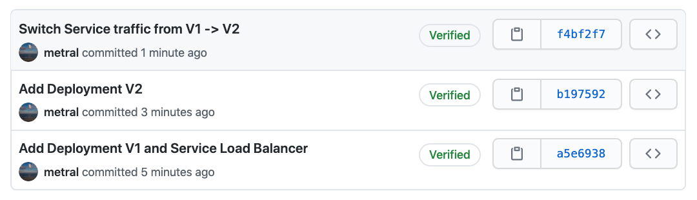

# Blue/Green Kubernetes Deployment Stack

This example project deploys the `pulumi-kubernetes-operator`, and a Pulumi
program as a [`Stack`][stack-api-type] CustomResource once the operator is up and running.

We'll walk through deploying a Blue/Green Kubernetes App Deployment in the same
cluster as the operator.

We'll use the Stack CustomResource to capture the Pulumi project's settings,
and the operator will drive the Pulumi updates for us, all natively in
Kubernetes.

## Overview

The Stack CustomResource encapsulates a Pulumi project that creates an 
[Kubernetes App Deployment][pulumi-k8s-app] from an existing Git repo, and checks out a
specific commit SHA of the repo to deploy.

The App is an example of a Blue/Green Deployment in Kubernetes. This deploys an
initial version of the app to the Internet, and then deploys an updated version
beside the initial version. Once ready, we'll switch the traffic from the
initial version to the new version.


## Requirements

* [Get Started with Pulumi and Kubernetes][get-started-k8s].
* You can use an existing Kubernetes cluster, or create a new [managed Kubernetes cluster](https://www.pulumi.com/docs/tutorials/kubernetes/#clusters).

## App Deployment

The application is a stateless HTTP server that returns request information and
the version of the Pod serving the response.

The commit history of the App Deployment git repo reflects the sequential
changes one would make when building out a rolling deployment of a live
service.

Here is commit history of the repo, where the bottommost commit is the initial commit,
followed by two changes.



For the sake of this demo we'll "skip ahead" to start with the "Add Deployment V2" commit.

At the V2 commit, we'll have deployed the following resources in Kubernetes.

- V1 of the Deployment, with a public Service Load Balancer attached to it to
  serve traffic. 
- V2 of the Deployment that is **not** serving traffic since the Service still selects
  the V1 Pods, and we have not yet switched traffic between deployments.

## Initialize the Pulumi Project

1.  Clone the repo:

    ```bash
    git clone https://github.com/pulumi/pulumi-kubernetes-operator
	cd examples/blue-green
    ```

1.  Install the dependencies.

    ```bash
    npm install
    ```

1.  Create a new Pulumi [stack][stack] named `dev`.

    ```bash
    pulumi stack init dev
    ```

1. Set the Pulumi [configuration][pulumi-config] variables for the project.

    In this step, we'll configure the Pulumi settings `stackProjectRepo` and
    `stackCommit` to reflect that we want to use the app's Git repo, and a given commit. 

    You'll first need to grab a Pulumi API access token from the Pulumi Service.
  
    * Visit the [Pulumi Service][pulumi-service].
    * In your profile, click 'Settings' -> 'Access Tokens'.
    * Generate a new access token.
  
    Now configure the Stack settings by copy/pasting the following, and replacing
    the token with your newly created one.
  
    ```bash
    pulumi config set --secret pulumiAccessToken <YOUR_PULUMI_API_TOKEN>
    pulumi config set stackProjectRepo https://github.com/metral/pulumi-blue-green
    pulumi config set stackCommit b19759220f25476605620fdfffeface39a630246
    ```

1. Next, open `index.ts` and edit the `stack` field in the Stack CustomResource
   to replace `<YOUR_ORG>` with your Pulumi user / organization.

## Run the Update

The update will deploy the operator to Kubernetes, along with the Stack for the App.

```bash
pulumi up
```

Once the update is complete, verify the operator Pod is up and running:

```bash
$ kubectl get pods -o wide -l name=pulumi-kubernetes-operator

NAME                                           READY   STATUS    RESTARTS   AGE
pulumi-kubernetes-operator-6c4d99b4b6-wqbxg    1/1     Running   0          2m39s
```

## Verify the Operator and Stack are running

In another terminal, you can tail the logs of the operator to see it in action.

```bash
kubectl logs -l name=pulumi-kubernetes-operator -f
```

You should see output similar to the details below.

<details>
<summary>Operator Logs</summary>

```bash
{"level":"info","ts":1596670494.811147,"logger":"cmd","msg":"Operator Version: 0.0.1"}
{"level":"info","ts":1596670494.8112128,"logger":"cmd","msg":"Go Version: go1.14.6"}
{"level":"info","ts":1596670494.811226,"logger":"cmd","msg":"Go OS/Arch: linux/amd64"}
{"level":"info","ts":1596670494.811239,"logger":"cmd","msg":"Version of operator-sdk: v0.19.0"}
{"level":"info","ts":1596670494.811685,"logger":"leader","msg":"Trying to become the leader."}
{"level":"debug","ts":1596670494.812284,"logger":"k8sutil","msg":"Found namespace","Namespace":"default"}
{"level":"debug","ts":1596670495.4200032,"logger":"k8sutil","msg":"Found podname","Pod.Name":"pulumi-k8s-operator-oflyicyz-c5fcb74bb-nwmmg"}
{"level":"debug","ts":1596670495.4325237,"logger":"k8sutil","msg":"Found Pod","Pod.Namespace":"default","Pod.Name":"pulumi-k8s-operator-oflyicyz-c5fcb74bb-nwmmg"}
{"level":"info","ts":1596670495.439515,"logger":"leader","msg":"No pre-existing lock was found."}
{"level":"info","ts":1596670495.446492,"logger":"leader","msg":"Became the leader."}
{"level":"info","ts":1596670496.05202,"logger":"controller-runtime.metrics","msg":"metrics server is starting to listen","addr":"0.0.0.0:8383"}
{"level":"info","ts":1596670496.0524654,"logger":"cmd","msg":"Registering Components."}
{"level":"debug","ts":1596670496.0533304,"logger":"k8sutil","msg":"Found namespace","Namespace":"default"}
{"level":"debug","ts":1596670496.0534427,"logger":"kubemetrics","msg":"Starting collecting operator types"}
{"level":"debug","ts":1596670496.0534692,"logger":"kubemetrics","msg":"Generating metric families","apiVersion":"pulumi.com/v1alpha1","kind":"Stack"}
{"level":"debug","ts":1596670496.6598341,"logger":"kubemetrics","msg":"Starting serving custom resource metrics"}
{"level":"debug","ts":1596670497.2633405,"logger":"k8sutil","msg":"Found namespace","Namespace":"default"}
{"level":"debug","ts":1596670497.263389,"logger":"k8sutil","msg":"Found podname","Pod.Name":"pulumi-k8s-operator-oflyicyz-c5fcb74bb-nwmmg"}
{"level":"debug","ts":1596670497.2673438,"logger":"k8sutil","msg":"Found Pod","Pod.Namespace":"default","Pod.Name":"pulumi-k8s-operator-oflyicyz-c5fcb74bb-nwmmg"}
{"level":"debug","ts":1596670497.2744577,"logger":"metrics","msg":"Pods owner found","Kind":"Deployment","Name":"pulumi-k8s-operator-oflyicyz","Namespace":"default"}
{"level":"info","ts":1596670497.2933679,"logger":"metrics","msg":"Metrics Service object created","Service.Name":"pulumi-kubernetes-operator-metrics","Service.Namespace":"default"}
{"level":"info","ts":1596670497.895708,"logger":"cmd","msg":"Could not create ServiceMonitor object","error":"no ServiceMonitor registered with the API"}
{"level":"info","ts":1596670497.895745,"logger":"cmd","msg":"Install prometheus-operator in your cluster to create ServiceMonitor objects","error":"no ServiceMonitor registered with the API"}
{"level":"info","ts":1596670497.8957741,"logger":"cmd","msg":"Starting the Cmd."}
{"level":"info","ts":1596670497.8959763,"logger":"controller-runtime.manager","msg":"starting metrics server","path":"/metrics"}
{"level":"info","ts":1596670497.8962705,"logger":"controller-runtime.controller","msg":"Starting EventSource","controller":"stack-controller","source":"kind source: /, Kind="}
{"level":"info","ts":1596670497.9967818,"logger":"controller-runtime.controller","msg":"Starting Controller","controller":"stack-controller"}
{"level":"info","ts":1596670497.9968302,"logger":"controller-runtime.controller","msg":"Starting workers","controller":"stack-controller","worker count":10}
{"level":"info","ts":1596670497.9971669,"logger":"controller_stack","msg":"Reconciling Stack","Request.Namespace":"default","Request.Name":"app-stack-ba5xfcep"}
{"level":"info","ts":1596670498.0985982,"logger":"controller_stack","msg":"Cloning Stack repo","Request.Namespace":"default","Request.Name":"app-stack-ba5xfcep","Stack.Name":"metral/pulumi-blue-green/dev","Stack.Repo":"https://github.com/metral/pulumi-blue-green","Stack.Commit":"b19759220f25476605620fdfffeface39a630246","Stack.Branch":""}
{"level":"info","ts":1596670498.520844,"logger":"controller_stack","msg":"Running Pulumi command","Request.Namespace":"default","Request.Name":"app-stack-ba5xfcep","Args":["stack","select","--create","metral/pulumi-blue-green/dev"],"Workdir":"/tmp/671646363"}
{"level":"info","ts":1596670498.6513333,"logger":"controller_stack","msg":"Pulumi CLI","Request.Namespace":"default","Request.Name":"app-stack-ba5xfcep","Path":"/usr/bin/pulumi","Args":["pulumi","--non-interactive","stack","select","--create","metral/pulumi-blue-green/dev"],"Text":"Logging in using access token from PULUMI_ACCESS_TOKEN"}
{"level":"info","ts":1596670498.9174142,"logger":"controller_stack","msg":"Pulumi CLI","Request.Namespace":"default","Request.Name":"app-stack-ba5xfcep","Path":"/usr/bin/pulumi","Args":["pulumi","--non-interactive","stack","select","--create","metral/pulumi-blue-green/dev"],"Stdout":"Created stack 'dev'"}
{"level":"info","ts":1596670498.9182053,"logger":"controller_stack","msg":"Pulumi CLI","Request.Namespace":"default","Request.Name":"app-stack-ba5xfcep","Path":"/usr/bin/pulumi","Args":["pulumi","--non-interactive","stack","select","--create","metral/pulumi-blue-green/dev"],"Text":"warning: A new version of Pulumi is available. To upgrade from version '2.8.0' to '2.8.1', visit https://pulumi.com/docs/reference/install/ for manual instructions and release notes."}
{"level":"info","ts":1596670498.920837,"logger":"controller_stack","msg":"Running Pulumi command","Request.Namespace":"default","Request.Name":"app-stack-ba5xfcep","Args":["stack","select","metral/pulumi-blue-green/dev"],"Workdir":"/tmp/671646363"}
{"level":"info","ts":1596670499.2004008,"logger":"controller_stack","msg":"Pulumi CLI","Request.Namespace":"default","Request.Name":"app-stack-ba5xfcep","Path":"/usr/bin/pulumi","Args":["pulumi","--non-interactive","stack","select","metral/pulumi-blue-green/dev"],"Text":"warning: A new version of Pulumi is available. To upgrade from version '2.8.0' to '2.8.1', visit https://pulumi.com/docs/reference/install/ for manual instructions and release notes."}
{"level":"info","ts":1596670505.8546064,"logger":"controller_stack","msg":"NPM/Yarn","Request.Namespace":"default","Request.Name":"app-stack-ba5xfcep","Path":"/usr/bin/npm","Args":["/usr/bin/npm","install"],"Stdout":""}
{"level":"info","ts":1596670505.8550372,"logger":"controller_stack","msg":"NPM/Yarn","Request.Namespace":"default","Request.Name":"app-stack-ba5xfcep","Path":"/usr/bin/npm","Args":["/usr/bin/npm","install"],"Stdout":"> @pulumi/kubernetes@2.4.2 install /tmp/671646363/node_modules/@pulumi/kubernetesx/node_modules/@pulumi/kubernetes"}
{"level":"info","ts":1596670505.8552237,"logger":"controller_stack","msg":"NPM/Yarn","Request.Namespace":"default","Request.Name":"app-stack-ba5xfcep","Path":"/usr/bin/npm","Args":["/usr/bin/npm","install"],"Stdout":"> node scripts/install-pulumi-plugin.js resource kubernetes v2.4.2"}
{"level":"info","ts":1596670505.8552744,"logger":"controller_stack","msg":"NPM/Yarn","Request.Namespace":"default","Request.Name":"app-stack-ba5xfcep","Path":"/usr/bin/npm","Args":["/usr/bin/npm","install"],"Stdout":""}
{"level":"info","ts":1596670506.0300298,"logger":"controller_stack","msg":"NPM/Yarn","Request.Namespace":"default","Request.Name":"app-stack-ba5xfcep","Path":"/usr/bin/npm","Args":["/usr/bin/npm","install"],"Text":"[resource plugin kubernetes-2.4.2] installing"}
{"level":"info","ts":1596670508.6513176,"logger":"controller_stack","msg":"NPM/Yarn","Request.Namespace":"default","Request.Name":"app-stack-ba5xfcep","Path":"/usr/bin/npm","Args":["/usr/bin/npm","install"],"Stdout":"\rDownloading plugin: 0 B / 26.53 MiB    0.00%\rDownloading plugin: 3.81 MiB / 26.53 MiB   14.37% 1s\rDownloading plugin: 7.19 MiB / 26.53 MiB   27.09% 1s\rDownloading plugin: 9.81 MiB / 26.53 MiB   36.98% 1s\rDownloading plugin: 12.25 MiB / 26.53 MiB   46.17%\rDownloading plugin: 15.81 MiB / 26.53 MiB   59.60%\rDownloading plugin: 19.94 MiB / 26.53 MiB   75.15%\rDownloading plugin: 22.44 MiB / 26.53 MiB   84.57%\rDownloading plugin: 25.69 MiB / 26.53 MiB   96.82%\rDownloading plugin: 26.53 MiB / 26.53 MiB  100.00%\rDownloading plugin: 26.53 MiB / 26.53 MiB  100.00%\rDownloading plugin: 26.53 MiB / 26.53 MiB  100.00%\rDownloading plugin: 26.53 MiB / 26.53 MiB  100.00%\rDownloading plugin: 26.53 MiB / 26.53 MiB  100.00% 2s"}
{"level":"info","ts":1596670508.6516335,"logger":"controller_stack","msg":"NPM/Yarn","Request.Namespace":"default","Request.Name":"app-stack-ba5xfcep","Path":"/usr/bin/npm","Args":["/usr/bin/npm","install"],"Stdout":"Moving plugin... done."}
{"level":"info","ts":1596670508.6515973,"logger":"controller_stack","msg":"NPM/Yarn","Request.Namespace":"default","Request.Name":"app-stack-ba5xfcep","Path":"/usr/bin/npm","Args":["/usr/bin/npm","install"],"Text":"warning: A new version of Pulumi is available. To upgrade from version '2.8.0' to '2.8.1', visit https://pulumi.com/docs/reference/install/ for manual instructions and release notes."}
{"level":"info","ts":1596670508.6610587,"logger":"controller_stack","msg":"NPM/Yarn","Request.Namespace":"default","Request.Name":"app-stack-ba5xfcep","Path":"/usr/bin/npm","Args":["/usr/bin/npm","install"],"Stdout":""}
{"level":"info","ts":1596670508.6613078,"logger":"controller_stack","msg":"NPM/Yarn","Request.Namespace":"default","Request.Name":"app-stack-ba5xfcep","Path":"/usr/bin/npm","Args":["/usr/bin/npm","install"],"Stdout":"> @pulumi/kubernetes@2.4.2 install /tmp/671646363/node_modules/@pulumi/kubernetes"}
{"level":"info","ts":1596670508.6614544,"logger":"controller_stack","msg":"NPM/Yarn","Request.Namespace":"default","Request.Name":"app-stack-ba5xfcep","Path":"/usr/bin/npm","Args":["/usr/bin/npm","install"],"Stdout":"> node scripts/install-pulumi-plugin.js resource kubernetes v2.4.2"}
{"level":"info","ts":1596670508.661576,"logger":"controller_stack","msg":"NPM/Yarn","Request.Namespace":"default","Request.Name":"app-stack-ba5xfcep","Path":"/usr/bin/npm","Args":["/usr/bin/npm","install"],"Stdout":""}
{"level":"info","ts":1596670508.8145726,"logger":"controller_stack","msg":"NPM/Yarn","Request.Namespace":"default","Request.Name":"app-stack-ba5xfcep","Path":"/usr/bin/npm","Args":["/usr/bin/npm","install"],"Text":"[resource plugin kubernetes-2.4.2] installing"}
{"level":"info","ts":1596670508.8149698,"logger":"controller_stack","msg":"NPM/Yarn","Request.Namespace":"default","Request.Name":"app-stack-ba5xfcep","Path":"/usr/bin/npm","Args":["/usr/bin/npm","install"],"Text":"warning: A new version of Pulumi is available. To upgrade from version '2.8.0' to '2.8.1', visit https://pulumi.com/docs/reference/install/ for manual instructions and release notes."}
{"level":"info","ts":1596670508.8315005,"logger":"controller_stack","msg":"NPM/Yarn","Request.Namespace":"default","Request.Name":"app-stack-ba5xfcep","Path":"/usr/bin/npm","Args":["/usr/bin/npm","install"],"Stdout":""}
{"level":"info","ts":1596670508.8317413,"logger":"controller_stack","msg":"NPM/Yarn","Request.Namespace":"default","Request.Name":"app-stack-ba5xfcep","Path":"/usr/bin/npm","Args":["/usr/bin/npm","install"],"Stdout":"> protobufjs@6.10.1 postinstall /tmp/671646363/node_modules/protobufjs"}
{"level":"info","ts":1596670508.8318534,"logger":"controller_stack","msg":"NPM/Yarn","Request.Namespace":"default","Request.Name":"app-stack-ba5xfcep","Path":"/usr/bin/npm","Args":["/usr/bin/npm","install"],"Stdout":"> node scripts/postinstall"}
{"level":"info","ts":1596670508.832026,"logger":"controller_stack","msg":"NPM/Yarn","Request.Namespace":"default","Request.Name":"app-stack-ba5xfcep","Path":"/usr/bin/npm","Args":["/usr/bin/npm","install"],"Stdout":""}
{"level":"info","ts":1596670509.0608752,"logger":"controller_stack","msg":"NPM/Yarn","Request.Namespace":"default","Request.Name":"app-stack-ba5xfcep","Path":"/usr/bin/npm","Args":["/usr/bin/npm","install"],"Text":"npm notice created a lockfile as package-lock.json. You should commit this file."}
{"level":"info","ts":1596670509.0643651,"logger":"controller_stack","msg":"NPM/Yarn","Request.Namespace":"default","Request.Name":"app-stack-ba5xfcep","Path":"/usr/bin/npm","Args":["/usr/bin/npm","install"],"Text":"npm WARN k8s-blue-green@ No description"}
{"level":"info","ts":1596670509.0664496,"logger":"controller_stack","msg":"NPM/Yarn","Request.Namespace":"default","Request.Name":"app-stack-ba5xfcep","Path":"/usr/bin/npm","Args":["/usr/bin/npm","install"],"Text":"npm WARN k8s-blue-green@ No repository field."}
{"level":"info","ts":1596670509.0684247,"logger":"controller_stack","msg":"NPM/Yarn","Request.Namespace":"default","Request.Name":"app-stack-ba5xfcep","Path":"/usr/bin/npm","Args":["/usr/bin/npm","install"],"Text":"npm WARN k8s-blue-green@ No license field."}
{"level":"info","ts":1596670509.068832,"logger":"controller_stack","msg":"NPM/Yarn","Request.Namespace":"default","Request.Name":"app-stack-ba5xfcep","Path":"/usr/bin/npm","Args":["/usr/bin/npm","install"],"Text":""}
{"level":"info","ts":1596670509.0705936,"logger":"controller_stack","msg":"NPM/Yarn","Request.Namespace":"default","Request.Name":"app-stack-ba5xfcep","Path":"/usr/bin/npm","Args":["/usr/bin/npm","install"],"Stdout":"added 103 packages from 153 contributors and audited 103 packages in 9.32s"}
{"level":"info","ts":1596670509.1434135,"logger":"controller_stack","msg":"NPM/Yarn","Request.Namespace":"default","Request.Name":"app-stack-ba5xfcep","Path":"/usr/bin/npm","Args":["/usr/bin/npm","install"],"Stdout":""}
{"level":"info","ts":1596670509.1434588,"logger":"controller_stack","msg":"NPM/Yarn","Request.Namespace":"default","Request.Name":"app-stack-ba5xfcep","Path":"/usr/bin/npm","Args":["/usr/bin/npm","install"],"Stdout":"13 packages are looking for funding"}
{"level":"info","ts":1596670509.1434674,"logger":"controller_stack","msg":"NPM/Yarn","Request.Namespace":"default","Request.Name":"app-stack-ba5xfcep","Path":"/usr/bin/npm","Args":["/usr/bin/npm","install"],"Stdout":"  run `npm fund` for details"}
{"level":"info","ts":1596670509.1434739,"logger":"controller_stack","msg":"NPM/Yarn","Request.Namespace":"default","Request.Name":"app-stack-ba5xfcep","Path":"/usr/bin/npm","Args":["/usr/bin/npm","install"],"Stdout":""}
{"level":"info","ts":1596670509.1443322,"logger":"controller_stack","msg":"NPM/Yarn","Request.Namespace":"default","Request.Name":"app-stack-ba5xfcep","Path":"/usr/bin/npm","Args":["/usr/bin/npm","install"],"Stdout":"found 0 vulnerabilities"}
{"level":"info","ts":1596670509.144563,"logger":"controller_stack","msg":"NPM/Yarn","Request.Namespace":"default","Request.Name":"app-stack-ba5xfcep","Path":"/usr/bin/npm","Args":["/usr/bin/npm","install"],"Stdout":""}
{"level":"info","ts":1596670509.1934073,"logger":"controller_stack","msg":"NPM/Yarn","Request.Namespace":"default","Request.Name":"app-stack-ba5xfcep","Path":"/usr/bin/npm","Args":["/usr/bin/npm","install"],"Text":""}
{"level":"info","ts":1596670509.1934557,"logger":"controller_stack","msg":"NPM/Yarn","Request.Namespace":"default","Request.Name":"app-stack-ba5xfcep","Path":"/usr/bin/npm","Args":["/usr/bin/npm","install"],"Text":"┌───────────────────────────────────────────────────┐"}
{"level":"info","ts":1596670509.1934702,"logger":"controller_stack","msg":"NPM/Yarn","Request.Namespace":"default","Request.Name":"app-stack-ba5xfcep","Path":"/usr/bin/npm","Args":["/usr/bin/npm","install"],"Text":"│              npm update check failed              │"}
{"level":"info","ts":1596670509.1934767,"logger":"controller_stack","msg":"NPM/Yarn","Request.Namespace":"default","Request.Name":"app-stack-ba5xfcep","Path":"/usr/bin/npm","Args":["/usr/bin/npm","install"],"Text":"│        Try running with sudo or get access        │"}
{"level":"info","ts":1596670509.193482,"logger":"controller_stack","msg":"NPM/Yarn","Request.Namespace":"default","Request.Name":"app-stack-ba5xfcep","Path":"/usr/bin/npm","Args":["/usr/bin/npm","install"],"Text":"│       to the local update config store via        │"}
{"level":"info","ts":1596670509.19353,"logger":"controller_stack","msg":"NPM/Yarn","Request.Namespace":"default","Request.Name":"app-stack-ba5xfcep","Path":"/usr/bin/npm","Args":["/usr/bin/npm","install"],"Text":"│ sudo chown -R $USER:$(id -gn $USER) /root/.config │"}
{"level":"info","ts":1596670509.1935382,"logger":"controller_stack","msg":"NPM/Yarn","Request.Namespace":"default","Request.Name":"app-stack-ba5xfcep","Path":"/usr/bin/npm","Args":["/usr/bin/npm","install"],"Text":"└───────────────────────────────────────────────────┘"}
{"level":"info","ts":1596670509.2092953,"logger":"controller_stack","msg":"Adding Finalizer for the Stack","Request.Namespace":"default","Request.Name":"app-stack-ba5xfcep","Stack.Name":"app-stack-ba5xfcep"}
{"level":"info","ts":1596670511.2246826,"logger":"controller_stack","msg":"Successfully updated Stack with default permalink","Request.Namespace":"default","Request.Name":"app-stack-ba5xfcep","Stack.Name":"metral/pulumi-blue-green/dev"}
{"level":"info","ts":1596670511.2247307,"logger":"controller_stack","msg":"Running Pulumi command","Request.Namespace":"default","Request.Name":"app-stack-ba5xfcep","Args":["up","--skip-preview","--yes"],"Workdir":"/tmp/671646363"}
{"level":"info","ts":1596670511.500611,"logger":"controller_stack","msg":"Pulumi CLI","Request.Namespace":"default","Request.Name":"app-stack-ba5xfcep","Path":"/usr/bin/pulumi","Args":["pulumi","--non-interactive","up","--skip-preview","--yes"],"Stdout":"Updating (dev):"}
{"level":"info","ts":1596670511.826138,"logger":"controller_stack","msg":"Pulumi CLI","Request.Namespace":"default","Request.Name":"app-stack-ba5xfcep","Path":"/usr/bin/pulumi","Args":["pulumi","--non-interactive","up","--skip-preview","--yes"],"Stdout":""}
{"level":"info","ts":1596670512.5109053,"logger":"controller_stack","msg":"Pulumi CLI","Request.Namespace":"default","Request.Name":"app-stack-ba5xfcep","Path":"/usr/bin/pulumi","Args":["pulumi","--non-interactive","up","--skip-preview","--yes"],"Stdout":" +  pulumi:pulumi:Stack pulumi-blue-green-dev creating "}
{"level":"info","ts":1596670516.5925415,"logger":"controller_stack","msg":"Pulumi CLI","Request.Namespace":"default","Request.Name":"app-stack-ba5xfcep","Path":"/usr/bin/pulumi","Args":["pulumi","--non-interactive","up","--skip-preview","--yes"],"Stdout":" +  kubernetes:apps:Deployment app-v2 creating "}
{"level":"info","ts":1596670516.5947893,"logger":"controller_stack","msg":"Pulumi CLI","Request.Namespace":"default","Request.Name":"app-stack-ba5xfcep","Path":"/usr/bin/pulumi","Args":["pulumi","--non-interactive","up","--skip-preview","--yes"],"Stdout":" +  kubernetes:apps:Deployment app-v1 creating "}
{"level":"info","ts":1596670516.596263,"logger":"controller_stack","msg":"Pulumi CLI","Request.Namespace":"default","Request.Name":"app-stack-ba5xfcep","Path":"/usr/bin/pulumi","Args":["pulumi","--non-interactive","up","--skip-preview","--yes"],"Stdout":" +  kubernetes:core:Service app creating "}
{"level":"info","ts":1596670516.7729654,"logger":"controller_stack","msg":"Pulumi CLI","Request.Namespace":"default","Request.Name":"app-stack-ba5xfcep","Path":"/usr/bin/pulumi","Args":["pulumi","--non-interactive","up","--skip-preview","--yes"],"Stdout":" +  kubernetes:apps:Deployment app-v1 creating "}
{"level":"info","ts":1596670516.7735074,"logger":"controller_stack","msg":"Pulumi CLI","Request.Namespace":"default","Request.Name":"app-stack-ba5xfcep","Path":"/usr/bin/pulumi","Args":["pulumi","--non-interactive","up","--skip-preview","--yes"],"Stdout":" +  kubernetes:apps:Deployment app-v2 creating "}
{"level":"info","ts":1596670516.8084342,"logger":"controller_stack","msg":"Pulumi CLI","Request.Namespace":"default","Request.Name":"app-stack-ba5xfcep","Path":"/usr/bin/pulumi","Args":["pulumi","--non-interactive","up","--skip-preview","--yes"],"Stdout":" +  kubernetes:apps:Deployment app-v2 creating [1/2] Waiting for app ReplicaSet be marked available"}
{"level":"info","ts":1596670516.8125312,"logger":"controller_stack","msg":"Pulumi CLI","Request.Namespace":"default","Request.Name":"app-stack-ba5xfcep","Path":"/usr/bin/pulumi","Args":["pulumi","--non-interactive","up","--skip-preview","--yes"],"Stdout":" +  kubernetes:apps:Deployment app-v1 creating [1/2] Waiting for app ReplicaSet be marked available"}
{"level":"info","ts":1596670516.8126647,"logger":"controller_stack","msg":"Pulumi CLI","Request.Namespace":"default","Request.Name":"app-stack-ba5xfcep","Path":"/usr/bin/pulumi","Args":["pulumi","--non-interactive","up","--skip-preview","--yes"],"Stdout":" +  kubernetes:apps:Deployment app-v2 creating [1/2] Waiting for app ReplicaSet be marked available (0/3 Pods available)"}
{"level":"info","ts":1596670516.8128176,"logger":"controller_stack","msg":"Pulumi CLI","Request.Namespace":"default","Request.Name":"app-stack-ba5xfcep","Path":"/usr/bin/pulumi","Args":["pulumi","--non-interactive","up","--skip-preview","--yes"],"Stdout":" +  kubernetes:apps:Deployment app-v1 creating [1/2] Waiting for app ReplicaSet be marked available (0/3 Pods available)"}
{"level":"info","ts":1596670516.817644,"logger":"controller_stack","msg":"Pulumi CLI","Request.Namespace":"default","Request.Name":"app-stack-ba5xfcep","Path":"/usr/bin/pulumi","Args":["pulumi","--non-interactive","up","--skip-preview","--yes"],"Stdout":" +  kubernetes:apps:Deployment app-v1 creating warning: [MinimumReplicasUnavailable] Deployment does not have minimum availability."}
{"level":"info","ts":1596670516.8210309,"logger":"controller_stack","msg":"Pulumi CLI","Request.Namespace":"default","Request.Name":"app-stack-ba5xfcep","Path":"/usr/bin/pulumi","Args":["pulumi","--non-interactive","up","--skip-preview","--yes"],"Stdout":" +  kubernetes:apps:Deployment app-v2 creating warning: [MinimumReplicasUnavailable] Deployment does not have minimum availability."}
{"level":"info","ts":1596670516.83197,"logger":"controller_stack","msg":"Pulumi CLI","Request.Namespace":"default","Request.Name":"app-stack-ba5xfcep","Path":"/usr/bin/pulumi","Args":["pulumi","--non-interactive","up","--skip-preview","--yes"],"Stdout":" +  kubernetes:core:Service app creating "}
{"level":"info","ts":1596670516.851848,"logger":"controller_stack","msg":"Pulumi CLI","Request.Namespace":"default","Request.Name":"app-stack-ba5xfcep","Path":"/usr/bin/pulumi","Args":["pulumi","--non-interactive","up","--skip-preview","--yes"],"Stdout":" +  kubernetes:core:Service app creating [1/3] Finding Pods to direct traffic to"}
{"level":"info","ts":1596670526.8197885,"logger":"controller_stack","msg":"Pulumi CLI","Request.Namespace":"default","Request.Name":"app-stack-ba5xfcep","Path":"/usr/bin/pulumi","Args":["pulumi","--non-interactive","up","--skip-preview","--yes"],"Stdout":" +  kubernetes:apps:Deployment app-v1 creating warning: [Pod app-v1-1hzqupxe-77b9b6787-b969r]: containers with unready status: [app]"}
{"level":"info","ts":1596670526.8227253,"logger":"controller_stack","msg":"Pulumi CLI","Request.Namespace":"default","Request.Name":"app-stack-ba5xfcep","Path":"/usr/bin/pulumi","Args":["pulumi","--non-interactive","up","--skip-preview","--yes"],"Stdout":" +  kubernetes:apps:Deployment app-v1 creating warning: [Pod app-v1-1hzqupxe-77b9b6787-ws672]: containers with unready status: [app]"}
{"level":"info","ts":1596670526.823491,"logger":"controller_stack","msg":"Pulumi CLI","Request.Namespace":"default","Request.Name":"app-stack-ba5xfcep","Path":"/usr/bin/pulumi","Args":["pulumi","--non-interactive","up","--skip-preview","--yes"],"Stdout":" +  kubernetes:apps:Deployment app-v1 creating warning: [Pod app-v1-1hzqupxe-77b9b6787-df8tk]: containers with unready status: [app]"}
{"level":"info","ts":1596670526.8243597,"logger":"controller_stack","msg":"Pulumi CLI","Request.Namespace":"default","Request.Name":"app-stack-ba5xfcep","Path":"/usr/bin/pulumi","Args":["pulumi","--non-interactive","up","--skip-preview","--yes"],"Stdout":" +  kubernetes:apps:Deployment app-v2 creating warning: [Pod app-v2-si930yt5-7b6bf997b9-cxbxm]: containers with unready status: [app]"}
{"level":"info","ts":1596670526.8297696,"logger":"controller_stack","msg":"Pulumi CLI","Request.Namespace":"default","Request.Name":"app-stack-ba5xfcep","Path":"/usr/bin/pulumi","Args":["pulumi","--non-interactive","up","--skip-preview","--yes"],"Stdout":" +  kubernetes:apps:Deployment app-v2 creating warning: [Pod app-v2-si930yt5-7b6bf997b9-bpqt5]: containers with unready status: [app]"}
{"level":"info","ts":1596670526.8304198,"logger":"controller_stack","msg":"Pulumi CLI","Request.Namespace":"default","Request.Name":"app-stack-ba5xfcep","Path":"/usr/bin/pulumi","Args":["pulumi","--non-interactive","up","--skip-preview","--yes"],"Stdout":" +  kubernetes:apps:Deployment app-v2 creating warning: [Pod app-v2-si930yt5-7b6bf997b9-h8b7r]: containers with unready status: [app]"}
{"level":"info","ts":1596670526.8547947,"logger":"controller_stack","msg":"Pulumi CLI","Request.Namespace":"default","Request.Name":"app-stack-ba5xfcep","Path":"/usr/bin/pulumi","Args":["pulumi","--non-interactive","up","--skip-preview","--yes"],"Stdout":" +  kubernetes:core:Service app creating [2/3] Attempting to allocate IP address to Service"}
{"level":"info","ts":1596670537.293569,"logger":"controller_stack","msg":"Pulumi CLI","Request.Namespace":"default","Request.Name":"app-stack-ba5xfcep","Path":"/usr/bin/pulumi","Args":["pulumi","--non-interactive","up","--skip-preview","--yes"],"Stdout":"@ Updating...."}
{"level":"info","ts":1596670537.2939093,"logger":"controller_stack","msg":"Pulumi CLI","Request.Namespace":"default","Request.Name":"app-stack-ba5xfcep","Path":"/usr/bin/pulumi","Args":["pulumi","--non-interactive","up","--skip-preview","--yes"],"Stdout":" +  kubernetes:apps:Deployment app-v2 creating [1/2] Waiting for app ReplicaSet be marked available (1/3 Pods available)"}
{"level":"info","ts":1596670539.7633338,"logger":"controller_stack","msg":"Pulumi CLI","Request.Namespace":"default","Request.Name":"app-stack-ba5xfcep","Path":"/usr/bin/pulumi","Args":["pulumi","--non-interactive","up","--skip-preview","--yes"],"Stdout":" +  kubernetes:apps:Deployment app-v1 creating [1/2] Waiting for app ReplicaSet be marked available (1/3 Pods available)"}
{"level":"info","ts":1596670541.985137,"logger":"controller_stack","msg":"Pulumi CLI","Request.Namespace":"default","Request.Name":"app-stack-ba5xfcep","Path":"/usr/bin/pulumi","Args":["pulumi","--non-interactive","up","--skip-preview","--yes"],"Stdout":" +  kubernetes:apps:Deployment app-v1 creating [1/2] Waiting for app ReplicaSet be marked available (2/3 Pods available)"}
{"level":"info","ts":1596670542.0594583,"logger":"controller_stack","msg":"Pulumi CLI","Request.Namespace":"default","Request.Name":"app-stack-ba5xfcep","Path":"/usr/bin/pulumi","Args":["pulumi","--non-interactive","up","--skip-preview","--yes"],"Stdout":" +  kubernetes:apps:Deployment app-v2 creating [1/2] Waiting for app ReplicaSet be marked available (2/3 Pods available)"}
{"level":"info","ts":1596670543.3618426,"logger":"controller_stack","msg":"Pulumi CLI","Request.Namespace":"default","Request.Name":"app-stack-ba5xfcep","Path":"/usr/bin/pulumi","Args":["pulumi","--non-interactive","up","--skip-preview","--yes"],"Stdout":" +  kubernetes:apps:Deployment app-v2 creating Deployment initialization complete"}
{"level":"info","ts":1596670543.3740852,"logger":"controller_stack","msg":"Pulumi CLI","Request.Namespace":"default","Request.Name":"app-stack-ba5xfcep","Path":"/usr/bin/pulumi","Args":["pulumi","--non-interactive","up","--skip-preview","--yes"],"Stdout":" +  kubernetes:apps:Deployment app-v2 created Deployment initialization complete"}
{"level":"info","ts":1596670544.3694828,"logger":"controller_stack","msg":"Pulumi CLI","Request.Namespace":"default","Request.Name":"app-stack-ba5xfcep","Path":"/usr/bin/pulumi","Args":["pulumi","--non-interactive","up","--skip-preview","--yes"],"Stdout":" +  kubernetes:apps:Deployment app-v1 creating Deployment initialization complete"}
{"level":"info","ts":1596670544.3901677,"logger":"controller_stack","msg":"Pulumi CLI","Request.Namespace":"default","Request.Name":"app-stack-ba5xfcep","Path":"/usr/bin/pulumi","Args":["pulumi","--non-interactive","up","--skip-preview","--yes"],"Stdout":" +  kubernetes:apps:Deployment app-v1 created Deployment initialization complete"}
{"level":"info","ts":1596670556.8207772,"logger":"controller_stack","msg":"Pulumi CLI","Request.Namespace":"default","Request.Name":"app-stack-ba5xfcep","Path":"/usr/bin/pulumi","Args":["pulumi","--non-interactive","up","--skip-preview","--yes"],"Stdout":"@ Updating...."}
{"level":"info","ts":1596670556.8208287,"logger":"controller_stack","msg":"Pulumi CLI","Request.Namespace":"default","Request.Name":"app-stack-ba5xfcep","Path":"/usr/bin/pulumi","Args":["pulumi","--non-interactive","up","--skip-preview","--yes"],"Stdout":" +  kubernetes:core:Service app creating Service initialization complete"}
{"level":"info","ts":1596670556.831084,"logger":"controller_stack","msg":"Pulumi CLI","Request.Namespace":"default","Request.Name":"app-stack-ba5xfcep","Path":"/usr/bin/pulumi","Args":["pulumi","--non-interactive","up","--skip-preview","--yes"],"Stdout":" +  kubernetes:core:Service app created Service initialization complete"}
{"level":"info","ts":1596670557.0319185,"logger":"controller_stack","msg":"Pulumi CLI","Request.Namespace":"default","Request.Name":"app-stack-ba5xfcep","Path":"/usr/bin/pulumi","Args":["pulumi","--non-interactive","up","--skip-preview","--yes"],"Stdout":" +  pulumi:pulumi:Stack pulumi-blue-green-dev created "}
{"level":"info","ts":1596670557.0319674,"logger":"controller_stack","msg":"Pulumi CLI","Request.Namespace":"default","Request.Name":"app-stack-ba5xfcep","Path":"/usr/bin/pulumi","Args":["pulumi","--non-interactive","up","--skip-preview","--yes"],"Stdout":" "}
{"level":"info","ts":1596670557.031975,"logger":"controller_stack","msg":"Pulumi CLI","Request.Namespace":"default","Request.Name":"app-stack-ba5xfcep","Path":"/usr/bin/pulumi","Args":["pulumi","--non-interactive","up","--skip-preview","--yes"],"Stdout":"Outputs:"}
{"level":"info","ts":1596670557.0319817,"logger":"controller_stack","msg":"Pulumi CLI","Request.Namespace":"default","Request.Name":"app-stack-ba5xfcep","Path":"/usr/bin/pulumi","Args":["pulumi","--non-interactive","up","--skip-preview","--yes"],"Stdout":"    url: \"http://34.105.116.99:80\""}
{"level":"info","ts":1596670557.0319908,"logger":"controller_stack","msg":"Pulumi CLI","Request.Namespace":"default","Request.Name":"app-stack-ba5xfcep","Path":"/usr/bin/pulumi","Args":["pulumi","--non-interactive","up","--skip-preview","--yes"],"Stdout":""}
{"level":"info","ts":1596670557.031997,"logger":"controller_stack","msg":"Pulumi CLI","Request.Namespace":"default","Request.Name":"app-stack-ba5xfcep","Path":"/usr/bin/pulumi","Args":["pulumi","--non-interactive","up","--skip-preview","--yes"],"Stdout":"Resources:"}
{"level":"info","ts":1596670557.032003,"logger":"controller_stack","msg":"Pulumi CLI","Request.Namespace":"default","Request.Name":"app-stack-ba5xfcep","Path":"/usr/bin/pulumi","Args":["pulumi","--non-interactive","up","--skip-preview","--yes"],"Stdout":"    + 4 created"}
{"level":"info","ts":1596670557.032008,"logger":"controller_stack","msg":"Pulumi CLI","Request.Namespace":"default","Request.Name":"app-stack-ba5xfcep","Path":"/usr/bin/pulumi","Args":["pulumi","--non-interactive","up","--skip-preview","--yes"],"Stdout":""}
{"level":"info","ts":1596670557.0320134,"logger":"controller_stack","msg":"Pulumi CLI","Request.Namespace":"default","Request.Name":"app-stack-ba5xfcep","Path":"/usr/bin/pulumi","Args":["pulumi","--non-interactive","up","--skip-preview","--yes"],"Stdout":"Duration: 46s"}
{"level":"info","ts":1596670557.0320196,"logger":"controller_stack","msg":"Pulumi CLI","Request.Namespace":"default","Request.Name":"app-stack-ba5xfcep","Path":"/usr/bin/pulumi","Args":["pulumi","--non-interactive","up","--skip-preview","--yes"],"Stdout":""}
{"level":"info","ts":1596670557.12621,"logger":"controller_stack","msg":"Pulumi CLI","Request.Namespace":"default","Request.Name":"app-stack-ba5xfcep","Path":"/usr/bin/pulumi","Args":["pulumi","--non-interactive","up","--skip-preview","--yes"],"Stdout":"Permalink: https://app.pulumi.com/metral/pulumi-blue-green/dev/updates/1"}
{"level":"info","ts":1596670557.126279,"logger":"controller_stack","msg":"Pulumi CLI","Request.Namespace":"default","Request.Name":"app-stack-ba5xfcep","Path":"/usr/bin/pulumi","Args":["pulumi","--non-interactive","up","--skip-preview","--yes"],"Text":"warning: A new version of Pulumi is available. To upgrade from version '2.8.0' to '2.8.1', visit https://pulumi.com/docs/reference/install/ for manual instructions and release notes."}
{"level":"info","ts":1596670557.1299994,"logger":"controller_stack","msg":"Running Pulumi command","Request.Namespace":"default","Request.Name":"app-stack-ba5xfcep","Args":["stack","output","--json"],"Workdir":"/tmp/671646363"}
{"level":"info","ts":1596670557.4647956,"logger":"controller_stack","msg":"Pulumi CLI","Request.Namespace":"default","Request.Name":"app-stack-ba5xfcep","Path":"/usr/bin/pulumi","Args":["pulumi","--non-interactive","stack","output","--json"],"Stdout":"{"}
{"level":"info","ts":1596670557.4651747,"logger":"controller_stack","msg":"Pulumi CLI","Request.Namespace":"default","Request.Name":"app-stack-ba5xfcep","Path":"/usr/bin/pulumi","Args":["pulumi","--non-interactive","stack","output","--json"],"Stdout":"  \"url\": \"http://34.105.116.99:80\""}
{"level":"info","ts":1596670557.4652588,"logger":"controller_stack","msg":"Pulumi CLI","Request.Namespace":"default","Request.Name":"app-stack-ba5xfcep","Path":"/usr/bin/pulumi","Args":["pulumi","--non-interactive","stack","output","--json"],"Stdout":"}"}
{"level":"info","ts":1596670557.4742835,"logger":"controller_stack","msg":"Successfully updated successful status for Stack","Request.Namespace":"default","Request.Name":"app-stack-ba5xfcep","Stack.Name":"metral/pulumi-blue-green/dev"}
{"level":"debug","ts":1596670557.7180536,"logger":"controller-runtime.controller","msg":"Successfully Reconciled","controller":"stack-controller","name":"app-stack-ba5xfcep","namespace":"default"}
```
</details>

Similarly, we can probe Kubernetes for the status of the Stack.

In the details, `stack.status` will show the following information when it is made available.

- A permalink URL for the Stack in the Pulumi Service when available.
- The last commit `state` of the Pulumi program that has been successfully deployed, and
- Any Pulumi stack outputs that exist. 

```bash
kubectl get stacks -o json -w
```

<details>
<summary>Stack details</summary>

```bash
{
    "apiVersion": "pulumi.com/v1alpha1",
    "kind": "Stack",
    "metadata": {
        "annotations": {
            "kubectl.kubernetes.io/last-applied-configuration": "{\"apiVersion\":\"pulumi.com/v1alpha1\",\"kind\":\"Stack\",\"metadata\":{\"annotations\":{\"pulumi.com/autonamed\":\"true\"},\"labels\":{\"app.kubernetes.io/managed-by\":\"pulumi\"},\"name\":\"app-stack-b6n7y519\"},\"spec\":{\"accessTokenSecret\":\"accesstoken-dnfb5jg2\",\"commit\":\"b19759220f25476605620fdfffeface39a630246\",\"destroyOnFinalize\":true,\"initOnCreate\":true,\"projectRepo\":\"https://github.com/metral/pulumi-blue-green\",\"stack\":\"metral/pulumi-blue-green/dev\"}}\n",
            "pulumi.com/autonamed": "true"
        },
        "creationTimestamp": "2020-08-05T23:48:57Z",
        "finalizers": [
            "finalizer.stack.pulumi.com"
        ],
        "generation": 1,
        "labels": {
            "app.kubernetes.io/managed-by": "pulumi"
        },
        "name": "app-stack-b6n7y519",
        "namespace": "default",
        "resourceVersion": "12841791",
        "selfLink": "/apis/pulumi.com/v1alpha1/namespaces/default/stacks/app-stack-b6n7y519",
        "uid": "99820358-e022-4478-a1eb-37a708989c08"
    },
    "spec": {
        "accessTokenSecret": "accesstoken-dnfb5jg2",
        "commit": "b19759220f25476605620fdfffeface39a630246",
        "destroyOnFinalize": true,
        "initOnCreate": true,
        "projectRepo": "https://github.com/metral/pulumi-blue-green",
        "stack": "metral/pulumi-blue-green/dev"
    },
    "status": {
        "lastUpdate": {
            "permalink": "https://app.pulumi.com/metral/pulumi-blue-green/dev/updates/1",
            "state": "b19759220f25476605620fdfffeface39a630246"
        },
        "outputs": {
            "url": "http://34.83.25.150:80"
        }
    }
}
```
</details>

Using `curl` we can validate that the App Deployment was deployed to the
cluster by the operator by checking its endpoint.

```bash
curl http://34.83.25.150:80/version

{"id":1,"content":"current"}
```

## Generate Traffic

To validate that we are making a clean cut-over from V1 to V2, we'll generate
consistent traffic to the endpoint.

```bash
while true; do curl http://34.83.25.150:80/version ; echo; sleep 1; done

{"id":1,"content":"current"}
{"id":1,"content":"current"}
{"id":1,"content":"current"}
{"id":1,"content":"current"}
...
```

## Switch Traffic from V1 to V2

With V1 deployed and validated, and the V2 deployment up and ready,
now it's time to switch over traffic of the Service from V1 to V2.

We'll make the changes by simply updating the project's `stackCommit` config
for the Stack CustomResource, and running another Pulumi update.

```bash
pulumi config set stackCommit f4bf2f7b54ec441d5af374933cca4ef09f2bce24
pulumi up
```

After a few seconds you should start seeing the generated traffic returning the
new version in a clean cut-over with no dropped packets.

```bash
...
{"id":1,"content":"current"}
{"id":1,"content":"current"}
{"id":1,"content":"current"}
{"id":1,"content":"current"}
{"id":1,"content":"current"}
{"id":1,"content":"current"}
{"id":1,"content":"current"}
{"id":1,"content":"current"}
{"id":2,"content":"new"}
{"id":2,"content":"new"}
{"id":2,"content":"new"}
{"id":2,"content":"new"}
{"id":2,"content":"new"}
...
```

## Wrap-Up

We used the pulumi-kubernetes-operator to drive Pulumi updates by
representing the program Stack natively in Kubernetes using the Stack
CustomResource.

The demo app showcased how to perform a Kubernetes Blue/Green Deployment, and
by driving towards the state of a given Git repo's commit, the operator is able
to reach a desired state in the lifecycle of your applications.

Given that the desired state for the operator is based on an explicit commit
SHA being checked out from the repo and deployed through Pulumi, we are able to
see how we can leverage this approach for CI/CD of your Pulumi programs.

Though we manually changed commits using the Pulumi config system, abstracting
program Stacks in this fashion showcases how Pulumi can be used to manage
Stacks natively in Kubernetes, opening up opportunities for further integration
and automation pipelines.

Lastly, a branch polling feature is [coming soon][branch-poll] to track Git branches
and automatically roll out changes as commits get pushed to the branch, so that
you don't have to manually update commits.

## Clean Up

Run the following command to tear down the resources that are part of our
stack.

1. Run `pulumi destroy` to tear down all resources.  You'll be prompted to make
   sure you really want to delete these resources.

   ```bash
   pulumi destroy
   ```

1. To delete the stack, run the following command.

   ```bash
   pulumi stack rm
   ```
   > **Note:** This command deletes all deployment history from the Pulumi
   > Console and cannot be undone.

[stack]: https://www.pulumi.com/docs/reference/stack.md
[pulumi-config]: https://www.pulumi.com/docs/reference/config
[get-started-k8s]: https://www.pulumi.com/docs/get-started/kubernetes/
[pulumi-service]: https://app.pulumi.com
[stack-api-type]: https://github.com/pulumi/pulumi-kubernetes-operator/blob/34b881610e87f0734c80a329cfdf5ce4c95b4f5d/pkg/apis/pulumi/v1alpha1/stack_types.go#L104-L110
[pulumi-k8s-app]: https://github.com/metral/pulumi-blue-green
[branch-poll]: https://github.com/pulumi/pulumi-kubernetes-operator/issues/50
